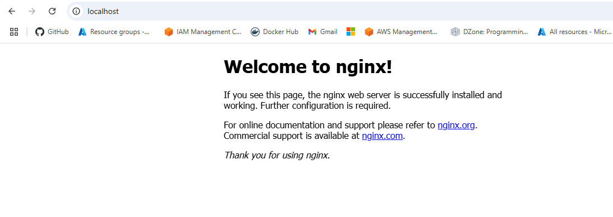

# volume mount in docker
* create a folder in local drive 
* mkdir -p opt/nginx [create a folder]
```sh
docker run -v opt/nginx:/usr/share/nginx -d -p 80:80 nginx 
```
# persistent volume 
-   volume which keeps the data stored in the local drive
it is mapped to container volume , when container dies we can create a new container with same configuration
- opt/nginx= local drive volume
- /usr/share/nginx = container volume


shaki@shakir MINGW64 /d/terraform-practice-lab/terraform-pipeline-150225 -github/mylearning (main)
```sh
$ docker images
```
REPOSITORY     TAG       IMAGE ID       CREATED        SIZE
nginx          latest    97662d24417b   13 days ago    192MB
kindest/node   <none>    529a3cc5dfdd   6 months ago   977MB

shaki@shakir MINGW64 /d/terraform-practice-lab/terraform-pipeline-150225 -github/mylearning (main)
```sh
$ docker run -d -p 80:80 nginx:latest
```
aca17bd5ce9c6aa1f6d248ffd53184fcf049d62e28ebc4f04e93f041dd95cadb

shaki@shakir MINGW64 /d/terraform-practice-lab/terraform-pipeline-150225 -github/mylearning (main)
```sh
$ docker ps -a
```
CONTAINER ID   IMAGE                  COMMAND                  CREATED         STATUS          PORTS                       NAMES
aca17bd5ce9c   nginx:latest           "/docker-entrypoint.…"   7 seconds ago   Up 6 seconds    0.0.0.0:80->80/tcp          heuristic_goodall
533f55ca456d   kindest/node:v1.29.8   "/usr/local/bin/entr…"   5 months ago    Up 27 minutes                               cka-cluster-2-worker2
dd4bdf430b49   kindest/node:v1.29.8   "/usr/local/bin/entr…"   5 months ago    Up 27 minutes   127.0.0.1:51727->6443/tcp   cka-cluster-2-control-plane
3b40a1589ec4   kindest/node:v1.29.8   "/usr/local/bin/entr…"   5 months ago    Up 27 minutes                               cka-cluster-2-worker
5977238e30ad   kindest/node:v1.29.8   "/usr/local/bin/entr…"   5 months ago    Up 27 minutes   127.0.0.1:54258->6443/tcp   cka-cluster1-1-control-plane

 shaki@shakir MINGW64 /d/terraform-practice-lab/terraform-pipeline-150225 -github/mylearning (main)
```sh
curl localhost
```
  % Total    % Received % Xferd  Average Speed   Time    Time     Time  Current
                                 Dload  Upload   Total   Spent    Left  Speed
100   615  100   615    0     0  37449      0 --:--:-- --:--:-- --:--:-- 38437<!DOCTYPE html>
<html>
<head>
<title>Welcome to nginx!</title>
<style>
html { color-scheme: light dark; }
body { width: 35em; margin: 0 auto;
font-family: Tahoma, Verdana, Arial, sans-serif; }
</style>
</head>
<body>
<h1>Welcome to nginx!</h1>
<p>If you see this page, the nginx web server is successfully installed and
working. Further configuration is required.</p>

<p>For online documentation and support please refer to
<a href="http://nginx.org/">nginx.org</a>.<br/>
Commercial support is available at
<a href="http://nginx.com/">nginx.com</a>.</p>

<p><em>Thank you for using nginx.</em></p>
</body>
</html>


shaki@shakir 
```sh
http://localhost:80
```





